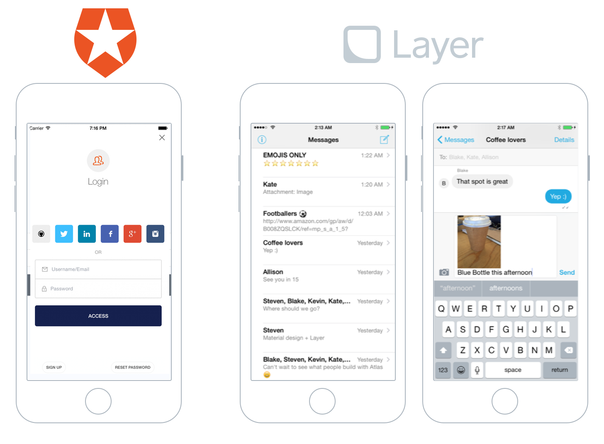
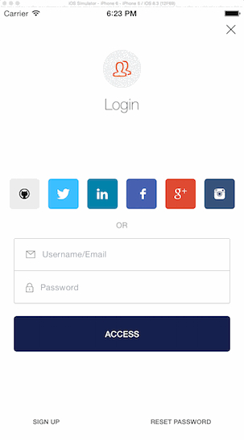

# Layer + Auth0 iOS Example

This repository contains an example project that demonstrates how to implement an iOS chat application with messaging services provided by [Layer](https://layer.com), user interface components from [Atlas](https://github.com/layerhq/Atlas-iOS) and a user backend provided by [Auth0](http://auth0.com).

## Requirements

This application requires Xcode and the iOS SDK v8.0. Dependencies are managed via [CocoaPods](http://cocoapods.org/) to simplify installation.

## Setup

1. Clone the project from Github: `$ git clone https://github.com/maju6406/Layer-Auth0-iOS-Example.git`
2. Install the dependencies in the root directory via CocoaPods: `$ pod install`
3. Open `Layer-Auth0-iOS-Example.xcworkspace` in Xcode.
4. Replace `LayerAppIDString` in `AppDelegate.m` with your Layer credentials.
5. Configure the Apps/Api->App Settings->Addon-Layer in [Auth0](https://manage.auth0.com) with your Layer Settings
6. Configure Auth0 credentials in the `Info.plist`
7. Build and run the application on your Simulator to create a new user and begin messaging!

## Highlights

* Uses [Lock](https://github.com/auth0/Lock.iOS-OSX) to authenticate and create new users.
* Uses [Atlas](https://atlas.layer.com), Layer's UI components

## Configuration

In order to populate the sample app with content, you must configure the following variable inside [AppDelegate.m](Code/AppDelegate.m):

* `LayerAppIDString`: The Layer application identifier for your application.

## Credits

This project was lovingly crafted in San Francisco. At Layer, we are building the full-stack building block for communications. We value, support, and create works of Open Source engineering excellence.

* [Abir Majumdar](http://github.com/maju6406)

## License

Layer-Auth0-iOS-Example is available under the Apache 2 License. See the LICENSE file for more info.
